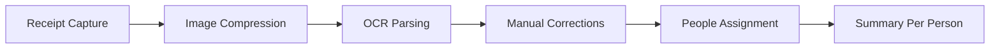

# Costco Bill Split

A mobile-friendly React app to split Costco receipts among friends.

It uses on-device OCR (`tesseract.js`) to extract line items from receipt photos, lets users correct parsed values, assign items to people, and generates a final per-person summary.

## Overview

- Capture a receipt using camera or upload an image
- OCR-based item extraction with editable results
- Assign items across people and compute totals
- Client-side processing (no backend required for core flow)
- Capacitor-ready setup for mobile packaging

## Architecture / Stack

- **Frontend:** React 18 + TypeScript + Vite
- **UI:** TailwindCSS + shadcn/ui + Radix
- **State:** React Context (`BillContext`)
- **OCR:** `tesseract.js`
- **Mobile packaging:** Capacitor (Android/iOS)



## Quickstart

### Prerequisites

- Node.js 18+
- npm (project also includes `bun.lockb`, but npm is supported)

### Install

```bash
npm install
```

## Environment Variables

This project currently does **not** require runtime environment variables for local development.

## Run

```bash
npm run dev
```

Default local URL: `http://localhost:5173`

## Test

There is no dedicated automated test script yet.

You can still validate quality with:

```bash
npm run lint
npm run build
```

## Deployment

### Static web deployment

Build and deploy the generated `dist/` output:

```bash
npm run build
npm run preview
```

### Mobile packaging (Capacitor)

Capacitor dependencies are present (`@capacitor/*`). Typical flow:

1. Build web assets (`npm run build`)
2. Sync Capacitor platform projects
3. Open Android/iOS project in native tooling

## Troubleshooting

- **Camera permission denied**
  - Allow camera access in browser/mobile app settings.
- **OCR accuracy is low**
  - Use brighter lighting, reduce glare, and capture the full receipt.
- **Slow OCR on large images**
  - Use a clear but compressed image (the app already performs compression).
- **Build fails due to Node version**
  - Use Node 18+ and reinstall dependencies.

## API Notes

This is a frontend-only project; there are no server API endpoints in this repository.

## Changelog

See [CHANGELOG.md](CHANGELOG.md).

## License

No `LICENSE` file is currently present in this repository.
To avoid guessing legal intent, this documentation update does not add one.
